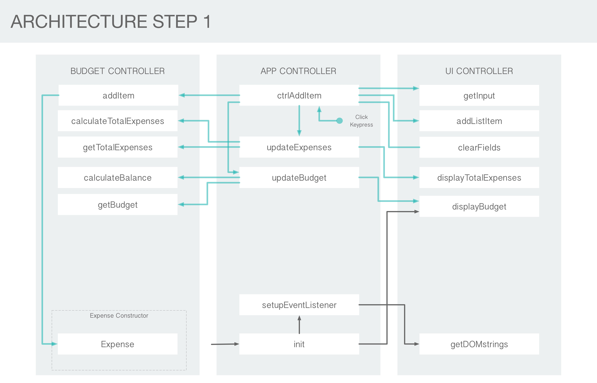
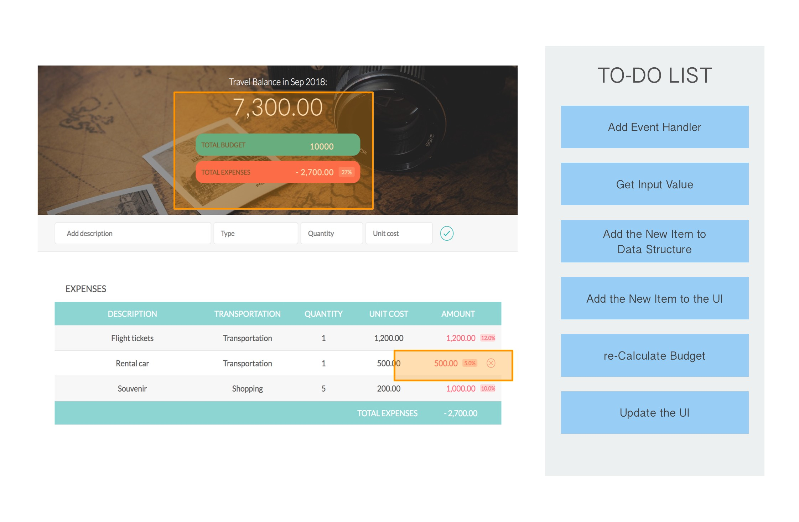

## Budgety
&nbsp;

### Introduction
Budgety is a simple but handy application for calculating travel budget

### Features
- Travel budget calculation
- Planning your travel budget
- Customizable categories for expenses
- Check ratis of expenses to budget

### Built with
HTML5, CSS3, Javascript(ES5 only)

### Planning Step-1

Users will input datas such as expenses' description, type, quantity and its value, and hit the input button or return(or enter) key. After that, the application will process datas and display on the user interface. To do this, the following are need to be done.
  
&nbsp;1. First, set event handler for the input button. 
&nbsp;2. Get the data values after users input datas.  
&nbsp;3. Add datas to the internal data structure and print out them on the UI. 
&nbsp;4. Calculate budget, balance and percentage and display them on the UI. 
 
In other words, the followings are the tasks that should be built. 
&nbsp;- Add event handler 
&nbsp;- Get input values 
&nbsp;- Add a new item to our data structure 
&nbsp;- Calculate budget 
&nbsp;- Update the UI 
 
As you can see, some tasks have to do with the user interface and some with internal data manipulation. So I could create modules for each of these task-related items. In this case, UI module and Data module. In addition to the two module, I could create a control module to control the entire app and act as a link betweeen the other two modules.
 
 

### Planning Step-2

In Step-2, I dealt with the functionality of deleting an item from data structure and user interface. I added event handler to the delete button. The application will delete the entire row as soon as the user clicks the delete button as well as from the the data structure.
  
The followings are that I built in this step. 
&nbsp;-Add event handler 
&nbsp;-Delete the item from the data structure 
&nbsp;-Delete the item from the UI 
&nbsp;-re-calculate the budget 
&nbsp;-Update the UI 
 

### Planning Step-3

Lastly, I added a couple of methods to calculate percentages of each expense which represent in percentage of the total budget and to display them on the UI.
  
I also added methods to display current month and year, and to format numbers.
  

### Bug / Feature request
If you find a bug, please kindly open an issue here with your expected result.

Should you have a request to add a new function, please feel free to ask me by opening an issue here.

### License
The MIT License (MIT)

The original version of this appication comes from Jonas's online javascript lecture. I jsut revised and added some features. If you want, you can check the original version at https://www.udemy.com/the-complete-javascript-course/?couponCode=C3RESOURCES1010.